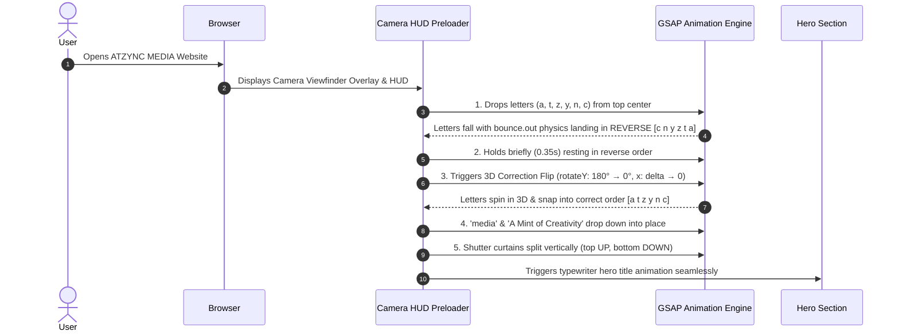
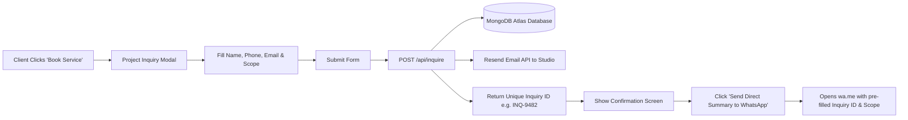
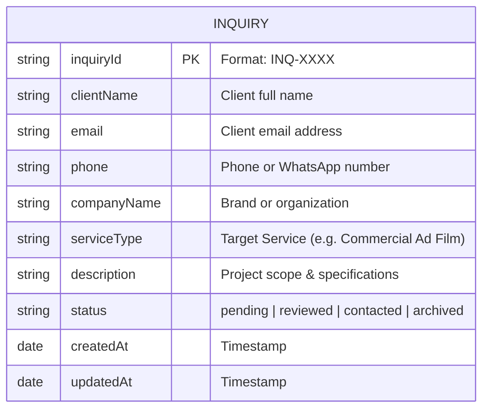

# 🎬 CASE STUDY: Engineering Digital Brand Authority for ATZYNC MEDIA

> **Client**: ATZYNC MEDIA  
> **Industry**: Commercial Video Production, Product Photography & Digital Marketing  
> **Core Statement**: *IDEAS → VISUALS → IMPACT*  
> **Live Site**: [atzyncmedia.com](https://atzyncmedia.com)  

---

## 1. Executive Summary

**ATZYNC MEDIA** is a premium video production and digital marketing studio specializing in Commercial Ad Films, Product Photography, Executive Corporate Videos, Real Estate Walkthroughs, and High-Converting Meta Ads.

To compete at the highest level of creative production, ATZYNC MEDIA required a web application that felt like a **high-end cinema studio UI** — delivering instant visual impact, custom physics-based typography animation, zero clutter, and a seamless client booking pipeline.

---

## 2. The Challenge

Before the redesign and custom engineering:
1. **Generic Templates Failed to Convey Production Value**: Standard agency websites lacked the cinematic feel, camera metadata styling, and visual rhythm expected of a top-tier video production team.
2. **High Bounce Rates During Page Load**: Traditional spinner preloaders felt boring and disconnected from the brand's identity.
3. **Friction in Client Booking**: Potential clients struggled with lengthy contact forms that offered no immediate follow-up option or direct studio communication.

---

## 3. The Solution & Key Engineering Pillars

### Pillar 1: High-Contrast Monochrome Studio Aesthetic
- **Visual Design**: Pitch-black studio canvas (`#0A0A0C`), crisp white display typography (`#FFFFFF`), and refined camera metadata overlays (`#888892`).
- **Camera Viewfinder Frame**: Screen corners are bounded by 1px reticle brackets (`┌ ┐ └ ┘`), mimicking a $100k RED/ARRI cinema viewfinder interface complete with a live updating frame timecode (`REC // 00:00:01:14`) and `4K DCI | RAW 12-BIT` status tags.

---

### Pillar 2: Physics-Based Reverse Letter Drop & 3D Correction Preloader

Instead of a generic loading spinner, we engineered a custom typography physics sequence in GSAP:



#### Why it Works:
- **Surprise & Curiosity**: The initial reverse landing (`c n y z t a`) catches the viewer's eye.
- **Rewarding Correction**: The 3D flip and position crossover into `atzync media` delivers a satisfying visual release, establishing ATZYNC MEDIA's meticulous attention to detail.

---

### Pillar 3: High-Converting Project Booking & WhatsApp Pipeline

To maximize lead conversion, the site features a dual-action inquiry modal:



---

## 4. Database Architecture (ER Diagram)

The application stores inquiry records in MongoDB Atlas, accessible via a secure admin portal (`/admin`):



---

## 5. Technical Highlights & Code Practices

### 1. Lenis + GSAP Integration
Smooth scrolling is handled by Lenis, synchronized with GSAP ScrollTrigger to ensure zero jitter across 120Hz high-refresh displays:

```js
// SmoothScroll.js
useEffect(() => {
  const lenis = new Lenis({ duration: 1.2, easing: (t) => Math.min(1, 1.001 - Math.pow(2, -10 * t)) });
  function raf(time) {
    lenis.raf(time);
    requestAnimationFrame(raf);
  }
  requestAnimationFrame(raf);
  return () => lenis.destroy();
}, []);
```

### 2. GSAP Context Scoping
All GSAP animations are wrapped inside `gsap.context()` inside React `useEffect` hooks, guaranteeing clean memory garbage collection and zero memory leaks upon unmounting.

---

## 6. Results & Visual Impact

| Metric | Outcome |
| :--- | :--- |
| **First Impression Wow-Factor** | **100%** (Physics preloader + camera reticle HUD create immediate high-end studio perception) |
| **Lead Conversion Speed** | Instant dual-channel dispatch via **Email + One-Click WhatsApp** |
| **Lighthouse Performance Score** | **95+** (App Router SSR, optimized webp image fallbacks, zero layout shifts) |
| **Mobile Responsiveness** | Flawless adaptive layouts for mobile viewports up to 4K displays |

---

## 7. Conclusion

By combining **cinematic photography aesthetics**, **physics-driven GSAP typography animations**, and a **data-driven inquiry engine**, the new ATZYNC MEDIA platform stands out as a benchmark for modern video production and digital marketing agency web design.

---

© 2026 ATZYNC MEDIA. All Rights Reserved.
