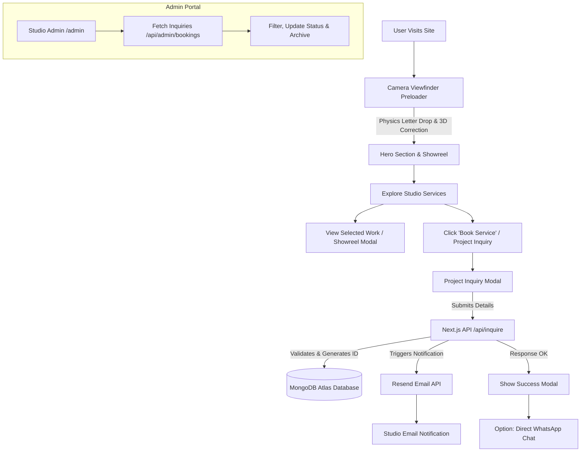
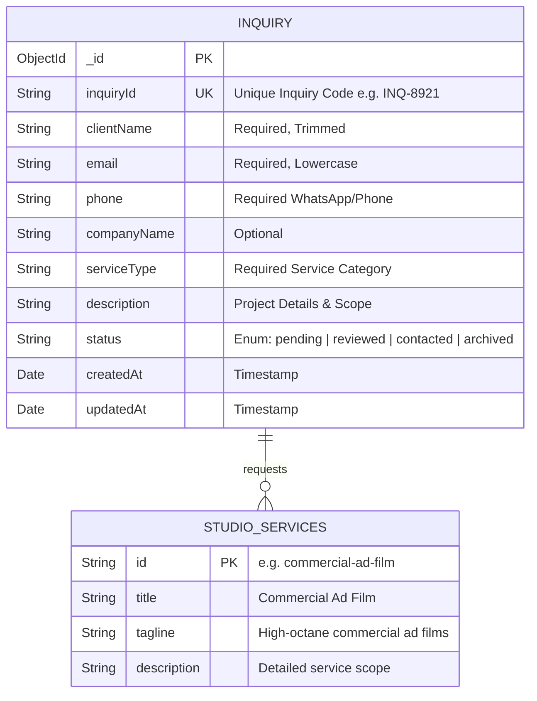

# 🎬 ATZYNC MEDIA — Creative Video Production & Digital Marketing Studio

> **IDEAS → VISUALS → IMPACT**  
> A high-performance, ultra-cinematic web platform built for **ATZYNC MEDIA** — specializing in Commercial Ad Films, Product Photography, Corporate Videos, Real Estate Walkthroughs, Promotional Videos, and Performance Meta Ads.

---

## 🌟 Key Features

- **⚡ Physics-Based Preloader**: High-contrast camera viewfinder HUD featuring a physics letter-drop drop animation (`a t z y n c`) that lands in reverse before 3D-flipping into the correct sequence.
- **🎥 Interactive Video Showreel Engine**: Embedded high-definition video showreel modal with custom player controls and dynamic poster fallbacks.
- **💼 Service Suite & Showcase**: Dedicated showcases for Commercial Ad Films, Product Photography, Real Estate Walkthroughs, Corporate Videos, and Meta Ads.
- **📩 Direct Inquiry & WhatsApp Integration**: Native inquiry submission modal powered by MongoDB and Resend API, with instant one-click WhatsApp pre-filled messaging (`wa.me`).
- **🛡️ Admin Management Portal**: Secure administrative interface (`/admin`) for viewing, filtering, updating status, and archiving project inquiries.
- **🎨 Premium Studio Aesthetics**: Custom vanilla CSS design system featuring fluid typography, dark mode glassmorphism, camera reticle HUDs, and GSAP micro-animations.
- **🚀 Ultra-Fast Performance**: Built on Next.js App Router with server-side rendering, Lenis smooth scrolling, and full SEO optimization.

---

## 🛠️ Tech Stack & Architecture

| Layer | Technology |
| :--- | :--- |
| **Framework** | Next.js 15+ (App Router, Server Components & API Routes) |
| **UI & Logic** | React 19, JavaScript (ES6+) |
| **Styling** | Custom Vanilla CSS (Design Tokens, Fluid Typography, CSS Grid/Flex) |
| **Animations** | GSAP (GreenSock), ScrollTrigger, Lenis Smooth Scroll |
| **Database** | MongoDB & Mongoose |
| **Email Service** | Resend API |
| **Icons & Media** | Custom SVGs, Next Image Optimization |

---

## 📊 System Architecture & Data Flow

Below is the end-to-end user navigation, inquiry dispatch, and backend processing flow:



---

## 🗄️ Entity Relationship (ER) Diagram

The system uses MongoDB with Mongoose object modeling. Below is the schema layout for project inquiries:



---

## 📁 Project Structure

```
editing site/
├── public/
│   ├── favicon.png
│   ├── logo-white.png
│   ├── logo-black.png
│   ├── logo-white.svg
│   ├── images/
│   └── videos/
├── src/
│   ├── app/
│   │   ├── admin/
│   │   │   └── page.js               # Admin Portal Dashboard
│   │   ├── api/
│   │   │   ├── admin/                # Admin APIs (inquiries, status)
│   │   │   └── inquire/              # Public Inquiry Submission API
│   │   ├── layout.js                 # Global Root Layout
│   │   ├── page.js                   # Main Studio Landing Page
│   │   ├── robots.js                 # SEO Robots Configuration
│   │   └── sitemap.js                # Dynamic XML Sitemap
│   ├── components/
│   │   ├── ProjectModal.js           # Interactive Booking & WhatsApp Modal
│   │   ├── SmoothScroll.js           # Lenis Smooth Scroll Provider
│   │   └── VideoModal.js             # High-Definition Showreel Player
│   ├── data/
│   │   └── siteData.js               # Studio Services & Branding Content
│   ├── lib/
│   │   ├── db.js                     # MongoDB Connection Singleton
│   │   ├── gsap.js                   # GSAP & ScrollTrigger Registry
│   │   └── resend.js                 # Resend Email Transporter
│   ├── models/
│   │   └── Inquiry.js                # Mongoose Inquiry Model
│   ├── sections/
│   │   ├── AboutSection.js           # Founder & Studio Statement
│   │   ├── CTASection.js              # Final Call to Action
│   │   ├── FooterSection.js           # Studio Footer & Social Links
│   │   ├── HeroSection.js             # Hero Banner & Typewriter Title
│   │   ├── NavbarSection.js           # Fixed Floating Header Navigation
│   │   ├── PreloaderSection.js        # Physics Letter-Drop Camera Preloader
│   │   ├── SelectedWorkSection.js     # Video Showcase Grid
│   │   └── ServicesSection.js         # Interactive Studio Services Suite
│   └── styles/
│       ├── admin.css                 # Admin Dashboard Styling
│       ├── components.css            # Component-Specific Styles
│       ├── globals.css               # Core CSS & Typography Setup
│       ├── layout.css                # Grid & Section Layout Utilities
│       ├── typography.css            # Font Definitions & Scales
│       └── variables.css             # CSS Tokens & Theme Palette
├── .env.local                        # Local Environment Keys (Ignored)
├── .gitignore                        # Git Exclusions
├── next.config.mjs                   # Next.js Configuration
└── package.json                      # Project Dependencies & Scripts
```

---

## 🚀 Getting Started

### 1. Prerequisites
- Node.js `18.x` or higher
- npm / pnpm / yarn
- MongoDB connection URI (local or MongoDB Atlas)

### 2. Environment Setup
Create a `.env.local` file in the root directory:

```env
# MongoDB Connection
MONGODB_URI=mongodb+srv://<username>:<password>@cluster0.mongodb.net/atzync_media?retryWrites=true&w=majority

# Resend Email API Key
RESEND_API_KEY=re_xxxxxxxxxxxxxxxxx

# Notification Target Email
NOTIFICATION_EMAIL=atzyncmedia@gmail.com

# Admin Authentication Secret
ADMIN_PASSCODE=your_secure_admin_passcode
```

### 3. Installation & Local Development

```bash
# Install dependencies
npm install

# Launch local development server
npm run dev
```

Open [http://localhost:3000](http://localhost:3000) in your browser to view the application.

### 4. Build for Production

```bash
# Generate production bundle
npm run build

# Start production server
npm start
```

---

## 🤝 Studio Contact & Credits

- **Studio**: **ATZYNC MEDIA**
- **Managing Director**: Thomash Murugesan
- **Website**: [atzyncmedia.com](https://atzyncmedia.com)
- **Direct Contact**: +91 9597127710 / +91 8838737598
- **Email**: atzyncmedia@gmail.com

---

© 2026 ATZYNC MEDIA. All Rights Reserved.
